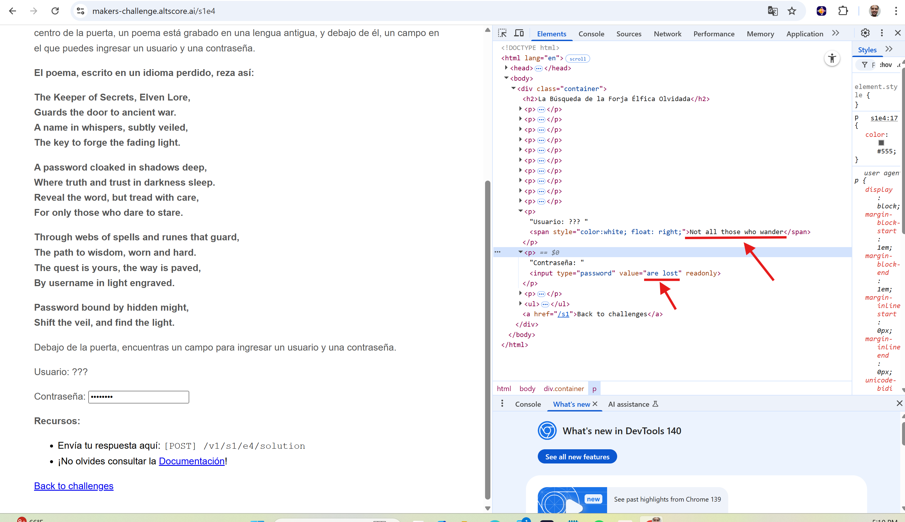

# S1E4 - La Forja Elírica Olvidada 🧝‍♂️

[View Challenge](https://makers-challenge.altscore.ai/s1e4)

## The Challenge
In the year 3018 of the Third Age, Middle-earth stands on the brink of war. The forces of Sauron grow stronger, but there exists a forgotten secret that could change the course of history: a hidden Elven forge, once used to create weapons capable of withstanding the Dark Lord's power.

## The Elven Clue
At the temple's entrance, you encounter a stone door carved with Elven runes. Upon it is inscribed a poem containing the clues needed to unlock the entrance:

```
The Keeper of Secrets, Elven Lore,
Guards the door to ancient war.
A name in whispers, subtly veiled,
The key to forge the fading light.

A password cloaked in shadows deep,
Where truth and trust in darkness sleep.
Reveal the word, but tread with care,
For only those who dare to stare.

Through webs of spells and runes that guard,
The path to wisdom, worn and hard.
The quest is yours, the way is paved,
By username in light engraved.

Password bound by hidden might,
Shift the veil, and find the light.
```

## The Solution
The poem contains hidden clues that reveal the credentials needed to access the forge. By examining the [challenge page's source code](https://makers-challenge.altscore.ai/s1e4), we find the hidden credentials in the HTML:

```html
<p>User: ???  <span style="color:white; float: right;">Not all those who wander</span></p>
<p>Password: <input type="password" value="are lost" readonly=""></p>
```



### Discovered Credentials
- **Username**: `Not all those who wander`
- **Password**: `are lost`

## Implementation
The solution is straightforward: make a POST request to the `/v1/s1/e4/solution` endpoint with the discovered credentials in the request body.

### Solution Code
```python
import requests

url = "https://makers-challenge.altscore.ai/v1/s1/e4/solution"
payload = {
    "username": "Not all those who wander",
    "password": "are lost",
}

response = requests.post(url, json=payload)
print(response.json())
```

### Example Output
```bash
(.venv) fprin@francisco-prin:~/personal/altscore/altscore-solutions/s1_e4_forja_elfica_olvidada$ python summit_solution.py
{"result":"correct"}
{'result': 'correct'}
```
