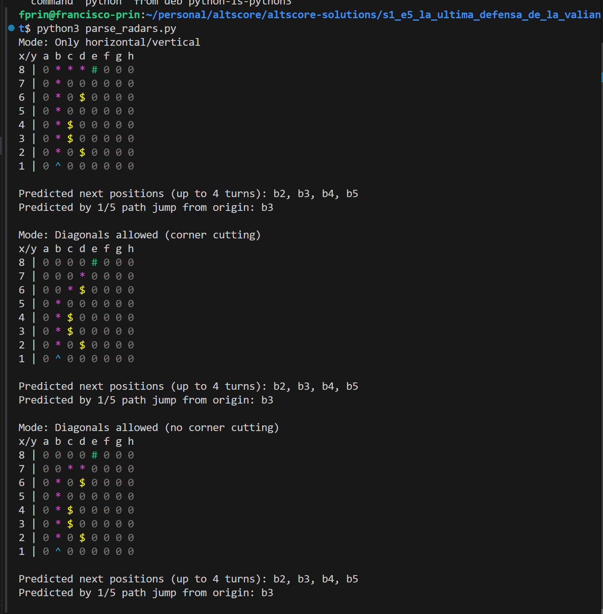
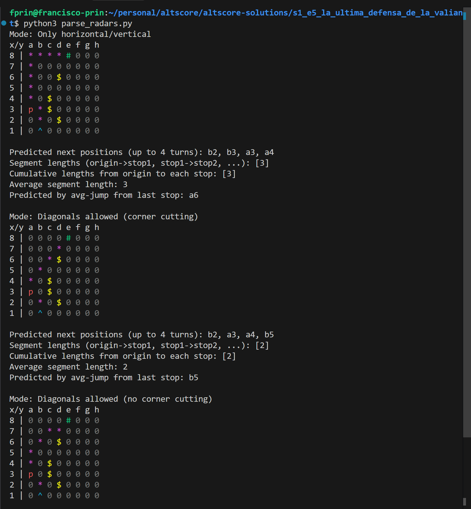
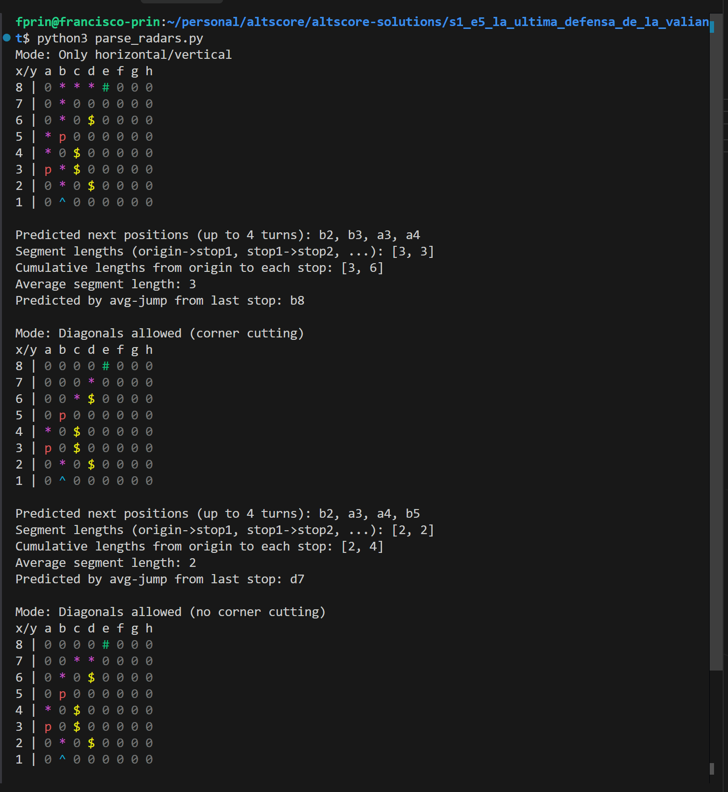
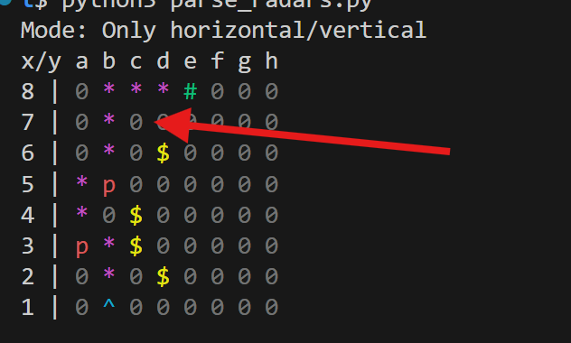

# S1E5 - La Última Defensa de la "Valiant" 🚀

[View Challenge](https://makers-challenge.altscore.ai/s1e5)

## Challenge Overview
Defend the supply ship "Hope" by predicting and intercepting an enemy vessel's movement across an 8x8 grid. With only one shot and four turns, you must determine the enemy's movement pattern before they reach their target.

### Key Constraints
- 8x8 grid (a1 to h8)
- 4 turns total
- Only 1 shot available
- 10-minute time limit
- Must choose between radar scan or attack each turn

## The Unknowns
Several key factors about the enemy's movement were unknown:
- Movement style (diagonal or horizontal/vertical)
- Whether corner-cutting was allowed
- Exact movement pattern

## Solution Approach

### 1. Data Collection & Analysis
Collected radar readings using `read_radars.py` to track enemy movement across three turns:

| Turn 1: Starting position | Turn 2: Moved to a3 | Turn 3: Moved to b5 |
|---------------------------|---------------------|---------------------|
|  |  |  |
| **Position**: b1 | **Position**: a3 | **Position**: b5 |
| Starting point | 2 up, 1 left (L-shape) | 2 up, 1 right (L-shape) |

> *Movement pattern: The enemy ship moves in an L-shape, similar to a knight in chess*

### 2. Movement Analysis
Initially implemented BFS-based pathfinding in `parse_radars.py` to find the shortest path to the target (Hope ship), but discovered the enemy moved in an L-shaped pattern instead.

#### Horizontal/Vertical Analysis
```
Mode: Only horizontal/vertical
x/y a b c d e f g h
8 | 0 * * * # 0 0 0 
7 | 0 * 0 0 0 0 0 0 
6 | 0 * 0 $ 0 0 0 0 
5 | * p 0 0 0 0 0 0 
4 | * 0 $ 0 0 0 0 0 
3 | p * $ 0 0 0 0 0 
2 | 0 * 0 $ 0 0 0 0 
1 | 0 ^ 0 0 0 0 0 0 
```

#### Diagonal Movement Analysis
Interestingly, the diagonal movement analysis coincidentally predicted the correct next position:
```
Mode: Diagonals allowed (no corner cutting)
x/y a b c d e f g h
8 | 0 0 0 0 # 0 0 0 
7 | 0 0 * * 0 0 0 0 
6 | 0 * 0 $ 0 0 0 0 
5 | 0 p 0 0 0 0 0 0 
4 | * 0 $ 0 0 0 0 0 
3 | p 0 $ 0 0 0 0 0 
2 | 0 * 0 $ 0 0 0 0 
1 | 0 ^ 0 0 0 0 0 0 

Predicted by avg-jump from last stop: c7
```

### 3. Pattern Recognition
- Confirmed L-shaped movement (2 squares in one direction, then 1 square perpendicular)
- Ruled out standard movement patterns
- Predicted next position: c7

## Implementation

### Key Scripts
- `read_radars.py`: Collects and logs radar data
- `parse_radars.py`: Analyzes movement patterns
- `summit_solution.py`: Executes the final attack

### Successful Prediction
```bash
python summit_solution.py
{"performed_action":"attack","turns_remaining":0,"action_result":"Attack completed"}
```

## Movement Visualization

- Green: Start (b1)
- Blue: Moves (a3, b5)
- Red: Predicted (c7)
- Yellow: Target (e8)

## Key Insights
- Enemy moved in a consistent knight's L-shaped pattern, reminiscent of chess knight moves
- Movement became predictable after three radar readings
- Successfully intercepted at c7 on the final turn
- The BFS implementation, while initially intended for shortest-path analysis, helped visualize and confirm the L-shaped movement pattern
- The diagonal movement analysis coincidentally predicted the correct next position, though this was more luck than intention

## Final Thoughts
This challenge was a delightful throwback to playing chess with my father. The knight's movement pattern added a nice chess-like strategic element to the problem, making the solution both challenging and nostalgic.

## Dependencies
- Python 3.x
- `requests` library for API calls
